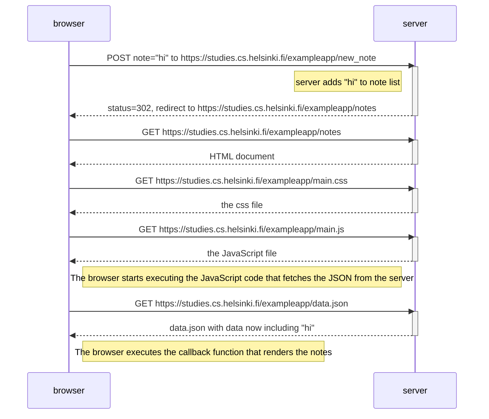

```mermaid
sequenceDiagram
    participant browser
    participant server

    browser->>server: POST note="hi" to https://studies.cs.helsinki.fi/exampleapp/new_note
    activate server
    Note left of server: server adds "hi" to note list
    server-->>browser: status=302, redirect to https://studies.cs.helsinki.fi/exampleapp/notes
    deactivate server

    browser->>server: GET https://studies.cs.helsinki.fi/exampleapp/notes
    activate server
    server-->>browser: HTML document
    deactivate server

    browser->>server: GET https://studies.cs.helsinki.fi/exampleapp/main.css
    activate server
    server-->>browser: the css file
    deactivate server

    browser->>server: GET https://studies.cs.helsinki.fi/exampleapp/main.js
    activate server
    server-->>browser: the JavaScript file
    deactivate server

    Note right of browser: The browser starts executing the JavaScript code that fetches the JSON from the server

    browser->>server: GET https://studies.cs.helsinki.fi/exampleapp/data.json
    activate server
    server-->>browser: data.json with data now including "hi"
    deactivate server

    Note right of browser: The browser executes the callback function that renders the notes
```