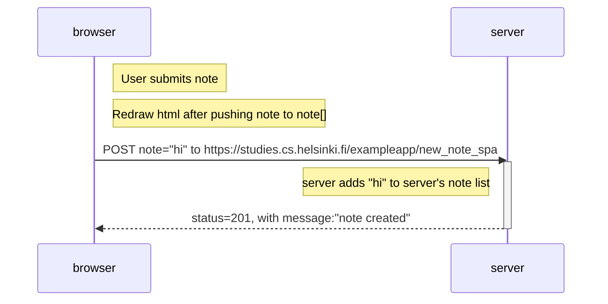

```mermaid
sequenceDiagram
    participant browser
    participant server

    Note right of browser: User submits note
    Note right of browser: Redraw html after pushing note to note[]

    browser->>server: POST note="hi" to https://studies.cs.helsinki.fi/exampleapp/new_note_spa
    activate server
    Note left of server: server adds "hi" to server's note list
    server-->>browser: status=201, with message:"note created"
    deactivate server
```